# Excalidraw Diagram Skill — Gallery

A visual portfolio of what this skill produces. Each pair below shows the
**visual argument** the diagram is trying to make on the left, and the
rendered output on the right. The skill emphasises *structure matching
concept* (fan-out, convergence, timeline, tree, cycle) over uniform
box-and-arrow grids.

---

## Simple Flow

A minimal 3-step left-to-right pipeline. Good for "what goes in, what comes
out" explanations.

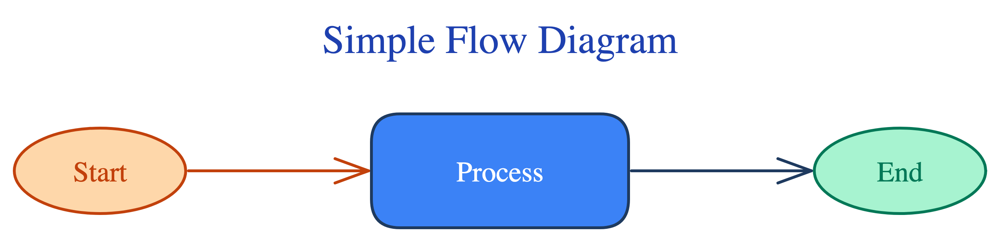

---

## Decision Flow

Branching diamond-based decision tree. Demonstrates semantic use of the
diamond shape for choice points.

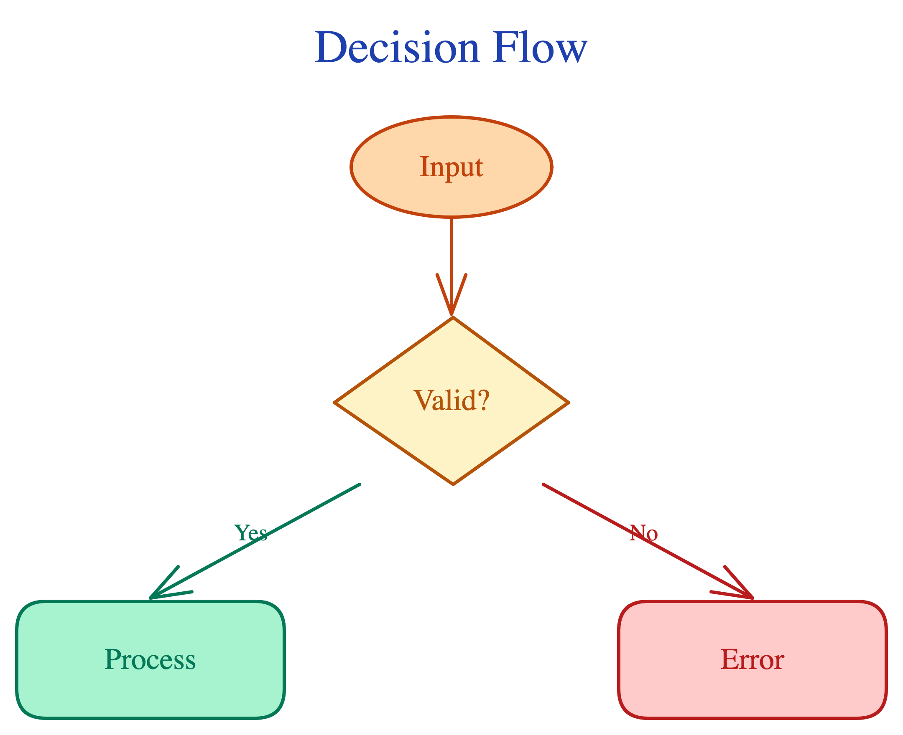

---

## All Patterns Catalog

A single diagram showcasing every supported visual pattern (fan-out,
convergence, timeline, tree, cycle, stack) side-by-side. Also the hero
image.

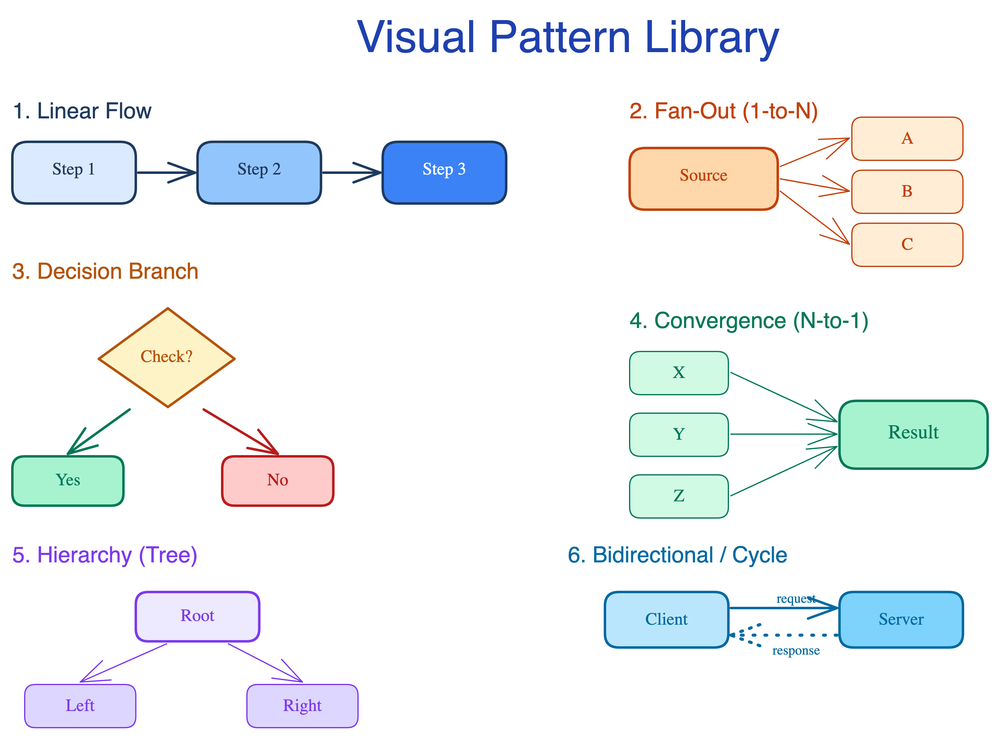

---

## Before / After Layout

Illustrates why alignment, gap consistency, and label placement matter.
The lint auto-fix can straighten up the "before" automatically.

| Before (bad layout)                              | After (good layout)                            |
|:-------------------------------------------------|:-----------------------------------------------|
| 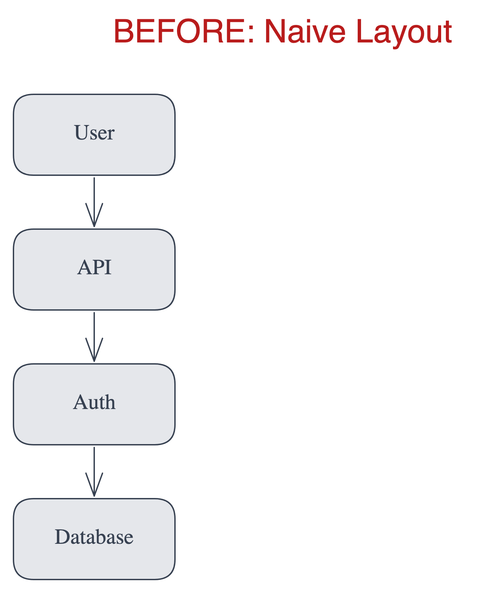       | 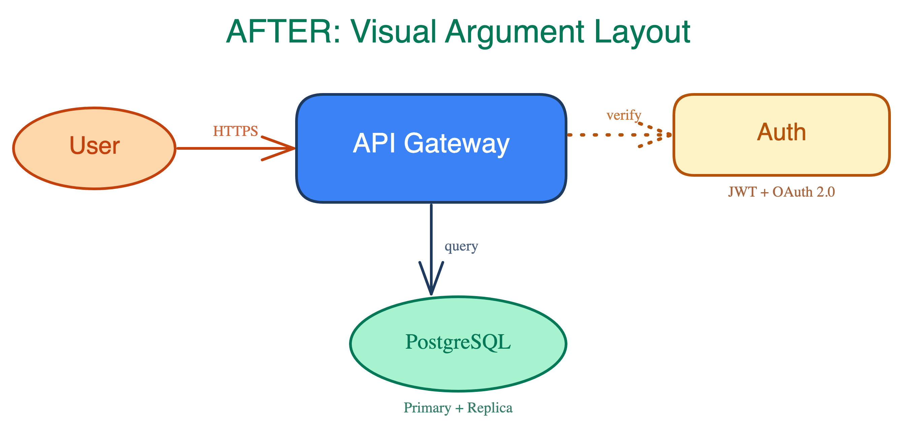      |

---

## RAG Pipeline (v2 7.7)

Retrieval-augmented generation as a fan-in / fan-out graph. Authored via
the shortform DSL (see `references/shortform.py`).

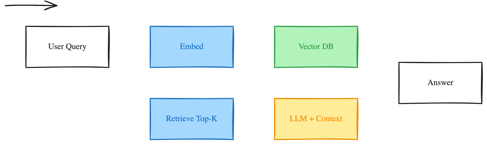

---

## Cycle / Feedback Loop (v2 7.7)

Plan -> Do -> Check -> Act, laid out spatially so the cycle is obvious at a
glance.

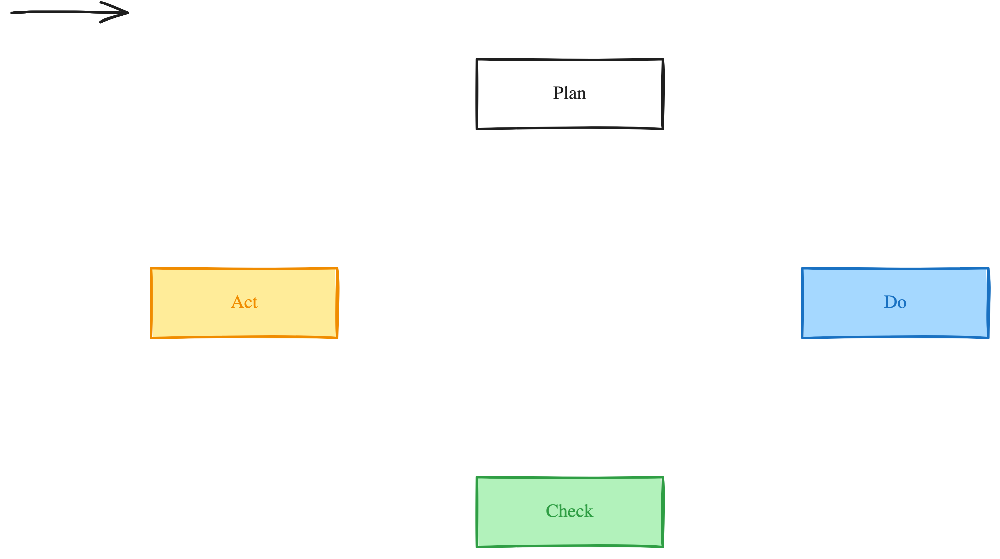

---

## AG-UI Protocol (v2 7.7)

The canonical agent / runtime / protocol topology used as SKILL.md's
motivating example.

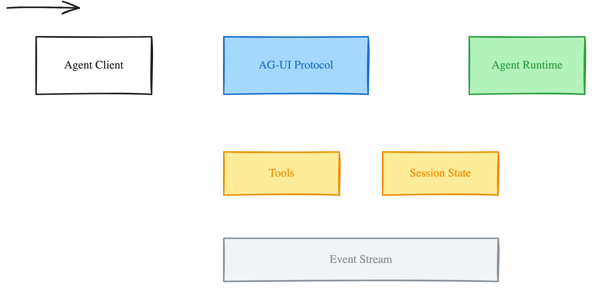

---

## Palettes (v2 7.8)

The same diagram under each alternative palette from
`references/color-palette.md`. Apply with `--theme warm|cool|high-contrast|minimal`.

| Warm                                                   | Cool                                                   |
|:-------------------------------------------------------|:-------------------------------------------------------|
| 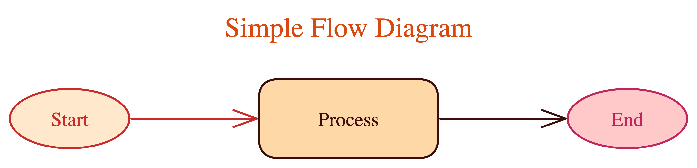        | 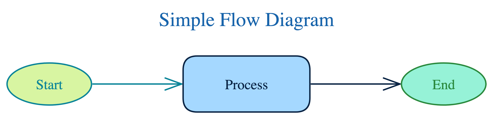        |

| High-contrast                                                           | Minimal                                                           |
|:------------------------------------------------------------------------|:------------------------------------------------------------------|
| 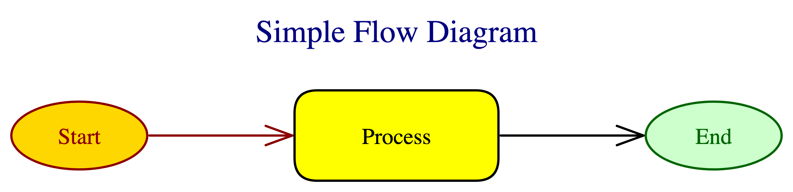 | 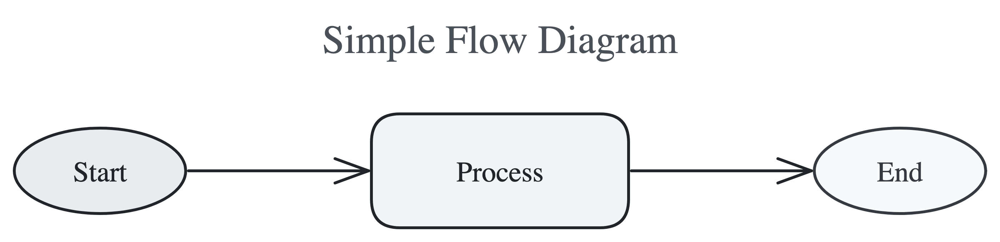             |
