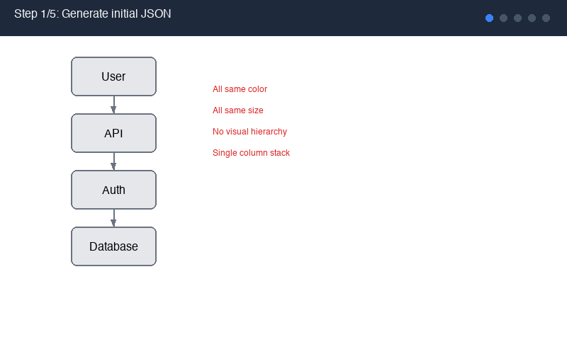

# Excalidraw Diagram Skill


A coding agent skill that generates beautiful and practical Excalidraw diagrams from natural language descriptions. Not just boxes-and-arrows - diagrams that **argue visually**.

See the [Gallery](GALLERY.md) for rendered examples.

Compatible with any coding agent that supports skills. For agents that read from `.claude/skills/` (like [Claude Code](https://docs.anthropic.com/en/docs/claude-code) and [OpenCode](https://github.com/nicepkg/OpenCode)), just drop it in and go.

## What Makes This Different

- **Diagrams that argue, not display.** Every shape/group of shapes mirrors the concept it represents -- fan-outs for one-to-many, timelines for sequences, convergence for aggregation. No uniform card grids.
- **Evidence artifacts.** As an example, technical diagrams include real code snippets and actual JSON payloads.
- **Built-in visual validation.** A Playwright-based render pipeline lets the agent see its own output, catch layout issues (overlapping text, misaligned arrows, unbalanced spacing), and fix them in a loop before delivering.
- **Brand-customizable.** All colors and brand styles live in a single file (`references/color-palette.md`). Swap it out and every diagram follows your palette.

## Installation

Clone or download this repo, then copy it into your project's `.claude/skills/` directory:

```bash
git clone https://github.com/coleam00/excalidraw-diagram-skill.git
cp -r excalidraw-diagram-skill .claude/skills/excalidraw-diagram
```

## Setup

The skill includes a render pipeline that lets the agent visually validate its diagrams. There are two ways to set it up:

**Option A: Ask your coding agent (easiest)**

Just tell your agent: *"Set up the Excalidraw diagram skill renderer by following the instructions in SKILL.md."* It will run the commands for you.

**Option B: Manual**

```bash
cd .claude/skills/excalidraw-diagram/references
uv sync
uv run playwright install chromium
```

**Verify installation:**

```bash
cd .claude/skills/excalidraw-diagram/references
uv run python render_excalidraw.py --check dummy
```

## Usage

Ask your coding agent to create a diagram:

> "Create an Excalidraw diagram showing how the AG-UI protocol streams events from an AI agent to a frontend UI"

The skill handles the rest -- concept mapping, layout, JSON generation, rendering, and visual validation.

### Render Options

```bash
# Basic render to PNG
uv run python render_excalidraw.py diagram.excalidraw

# SVG output (scalable)
uv run python render_excalidraw.py diagram.excalidraw --svg

# Dark mode
uv run python render_excalidraw.py diagram.excalidraw --dark

# Validate without rendering
uv run python render_excalidraw.py diagram.excalidraw --dry-run

# Interactive HTML export
uv run python render_excalidraw.py diagram.excalidraw --html

# Shareable URL
uv run python render_excalidraw.py diagram.excalidraw --url

# Format presets: presentation, blog, thumbnail, social
uv run python render_excalidraw.py diagram.excalidraw --format presentation
```

## How It Works

The skill uses an iterative **render-fix loop** where the agent generates a diagram, renders it, inspects the result for issues, and fixes them -- all automatically.



### Render Server Mode

For intensive iteration sessions, start a persistent render server to eliminate browser cold-start overhead:

```bash
cd .claude/skills/excalidraw-diagram/references
uv run python render_excalidraw.py --server
# Server listens on http://127.0.0.1:9120
# POST /render with JSON body to render diagrams
# POST /shutdown to stop
```

### Offline Mode (Vendor Bundle)

For air-gapped environments or faster renders without CDN latency:

```bash
cd .claude/skills/excalidraw-diagram/references
python vendor_excalidraw.py     # Downloads and bundles locally (requires npm)
# The render script auto-detects vendor/ and uses it
```

### Diagram Linting

Catch layout issues before rendering:

```bash
uv run python lint_excalidraw.py diagram.excalidraw           # Text report
uv run python lint_excalidraw.py diagram.excalidraw --json     # JSON output
uv run python lint_excalidraw.py diagram.excalidraw --fix      # Auto-fix issues
```

## Examples

See the `examples/` directory for sample `.excalidraw` files:

- **simple-flow.excalidraw** -- A basic Start -> Process -> End flow with semantic colors
- **decision-flow.excalidraw** -- A decision tree with diamond decision point and branching paths
- **all-patterns.excalidraw** -- Visual Pattern Library showing linear flow, fan-out, decision branch, convergence, hierarchy (tree), and bidirectional/cycle patterns
- **before-bad-layout.excalidraw** / **after-good-layout.excalidraw** -- Before/after comparison showing the difference between a naive layout and a visual argument layout

## Customize Colors

Edit `references/color-palette.md` to match your brand. The palette includes:
- Light mode semantic colors (default)
- Dark mode colors
- Alternative palette variants (warm, cool, high-contrast, minimal)

Everything else in the skill is universal design methodology.

## Compatibility

This skill works with any coding agent that can:
1. Read markdown files for instructions
2. Write JSON files
3. Execute shell commands (for rendering)

### Tested Agents

| Agent | Status | Notes |
|-------|--------|-------|
| [Claude Code](https://docs.anthropic.com/en/docs/claude-code) | Fully supported | Reads from `.claude/skills/` automatically |
| [OpenCode](https://github.com/nicepkg/OpenCode) | Fully supported | Same `.claude/skills/` convention |
| [Cursor](https://cursor.sh) | Compatible | Copy SKILL.md content to Cursor rules |
| [Windsurf](https://codeium.com/windsurf) | Compatible | Add SKILL.md as a workspace rule |
| [Aider](https://aider.chat) | Compatible | Pass SKILL.md as context with `--read` flag |

### Adapting for Other Agents

If your agent uses a different skill/rules directory:
1. Copy the entire `excalidraw-diagram-skill` folder to your agent's skill location
2. Update any path references in the render commands
3. Ensure the agent can execute `uv run python` commands

### Token Considerations

The SKILL.md file is approximately 700 lines. If your agent has strict context limits:
- Use the Quick Start section for minimal context
- Reference `element-templates.md` and `color-palette.md` separately as needed
- The render script works independently of the skill file

## File Structure

```
excalidraw-diagram/
  SKILL.md                          # Design methodology + workflow
  README.md                         # This file
  examples/
    simple-flow.excalidraw          # Basic flow example
    decision-flow.excalidraw        # Decision tree example
    all-patterns.excalidraw         # Visual Pattern Library showcase
    before-bad-layout.excalidraw    # Before: naive layout
    after-good-layout.excalidraw    # After: visual argument layout
    render-fix-loop.gif             # Animated demo of the render-fix loop
  references/
    color-palette.md                # Brand colors (edit this to customize)
    element-templates.md            # JSON templates + compound shape icons
    json-schema.md                  # Excalidraw JSON format reference
    render_excalidraw.py            # Render .excalidraw to PNG/SVG/HTML + server mode
    validate_excalidraw.py          # Standalone validation (no Playwright)
    lint_excalidraw.py              # Layout linter with auto-fix
    vendor_excalidraw.py            # Download Excalidraw for offline use
    generate_demo_gif.py            # Generate the render-fix loop GIF
    render_template.html            # Browser template for rendering
    pyproject.toml                  # Python dependencies (playwright, pillow)
    uv.lock                         # Locked dependency versions
    tests/                          # Pytest test suite
  .github/
    workflows/ci.yml                # CI pipeline
```

## Development

### Running Tests

```bash
cd references
uv sync --dev
uv run python -m pytest tests/ -v
```

### Multi-Page Diagrams

For complex systems needing multiple views:
- Name files by view: `system-overview.excalidraw`, `system-detail-auth.excalidraw`
- Use Excalidraw `link` properties to cross-reference between diagrams
- Render all files in a directory: `for f in *.excalidraw; do uv run python render_excalidraw.py "$f"; done`
